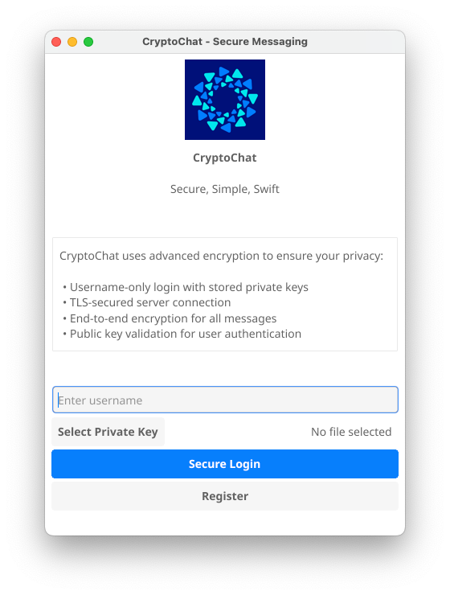
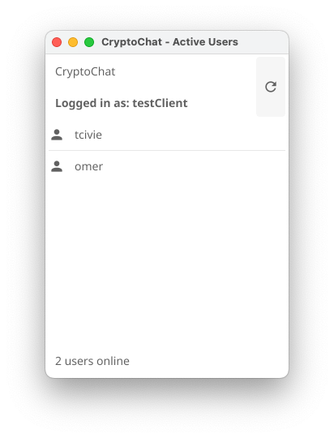
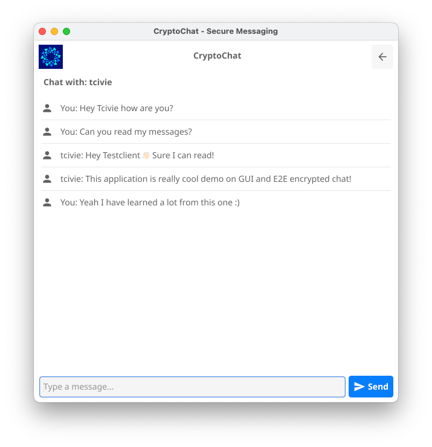

# End-to-End Secured Chat Application

This project implements a secure chat application with end-to-end encryption, ensuring privacy and security for user communications.
You can read more about the details of this project in the [REPORT.md](REPORT.md) file.

## Prerequisites

- Go (version 1.22.5 or later)
- Protocol Buffers compiler (protoc)
- SQLite

## Dependencies

### Client
- fyne.io/fyne/v2 v2.5.0
- golang.org/x/crypto v0.23.0
- google.golang.org/protobuf v1.26.0

### Server
- github.com/joho/godotenv v1.5.1
- golang.org/x/crypto v0.25.0
- google.golang.org/protobuf v1.34.2
- github.com/mattn/go-sqlite3 v1.14.22

## Setup

1. Clone the repository:

   ```
   git clone https://github.com/tcivie/GolangSecuredChat.git
   cd GolangSecuredChat
   ```

2. Generate Protocol Buffers code:

   ```
   protoc --go_out=client --go_opt=paths=source_relative resources/proto/packet.proto
   protoc --go_out=server --go_opt=paths=source_relative resources/proto/packet.proto
   ```

3. Set up the server:

   ```
   cd server
   go mod tidy
   cd ..
   ```

4. Set up the client:

   ```
   cd client
   go mod tidy
   cd ..
   ```

5. Generate TLS certificates for the server:

   ```
   openssl req -x509 -newkey rsa:4096 -keyout resources/auth/server-key.pem -out resources/auth/server-cert.pem -days 365 -nodes
   ```

6. Set the SERVER_ADDRESS environment variable for the clients:

   ```
   export SERVER_ADDRESS=localhost:8080
   ```

## Running the Application

1. Start the server:

   ```
   cd server/cmd
   go run main.go
   ```

2. In a new terminal, start a client:

   ```
   cd client/cmd
   go run main.go
   ```

3. Repeat step 2 for each additional client you want to run.

## Usage

1. When you start a client, you'll be prompted to enter a username and select a private key file.
2. If you're a new user, select "Register" to create a new account.
3. If you're an existing user, select "Login" to access your account.
4. Once logged in, you can view the list of online users and select a user to start a chat.
5. Enter your messages in the chat window. All messages are end-to-end encrypted for security.

## Security Features

- TLS encryption for all server-client communications
- Public-key authentication for users
- End-to-end encryption for all chat messages
- Secure key exchange for establishing encrypted communication channels
- One-way encryption of usernames in the server database

### Pictures
Login Screen for the user


After login you can see the list of online users


And the chat window (Which you can go back from and select other chat)


> If someone sends you a message it would be saved in the chat with him so you can switch chats 
> without worrying about losing the messages

## Authors
[tcivie](https://github.com/tcivie) , [omerAvi96](https://github.com/OmerAvi96)

## License

This project is licensed under the MIT License - see the [LICENSE.md](LICENSE) file for details.

## Acknowledgments

- Fyne: GUI toolkit for Go
- Protocol Buffers: Data serialization format
- SQLite: Embedded database
- godotenv: Environment variable loader
